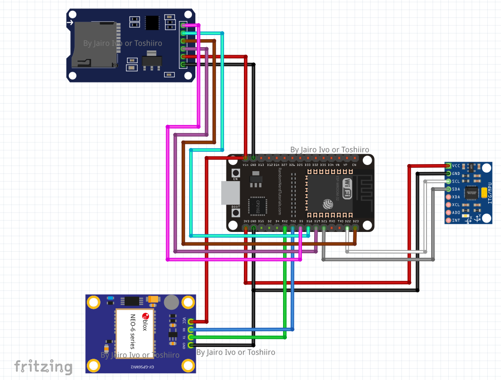

# PaveVibe

PaveVibe is an innovative project designed to measure the quality of pavement surfaces and identify defects in a georeferenced manner using accelerometer and GPS data. By leveraging the capabilities of an ESP32 microcontroller, PaveVibe collects precise movement and location data, enabling detailed analysis of pavement conditions and the pinpointing of areas in need of maintenance.

## Project Objective

The main objective of PaveVibe is to create a portable, efficient device that can detect and record pavement defects with precise geolocation information. This allows for a comprehensive mapping of pavement quality over large areas, providing valuable data for maintenance planning and infrastructure improvement efforts.

## Features

- **Real-time Clock Synchronization:** At startup, PaveVibe synchronizes the ESP32's internal RTC with GPS time. This ensures that even in the absence of GPS signals, the system retains accurate time information, which can be synchronized with smartphone apps like GPS Logger for enhanced data integrity.
- **Data Integration:** The repository includes a Jupyter Notebook (`tratamento e merge.ipynb`) designed to merge the data collected by PaveVibe from the SD card with `.gpx` files from GPS Logger. This process automatically handles missing columns and merges entries based on date and time, followed by interpolation and expansion of GPS data for comprehensive analysis.
- **Advanced Data Filtering:** Also featured is a Notebook (`Filtros_SMA_Butterworth_COMP.ipynb`) containing models for filtering accelerometer data using SMA (Simple Moving Average) and Butterworth filters, ensuring clean and reliable data for analysis.

## Getting Started

To get started with PaveVibe, follow these steps:

1. **Hardware Setup:** Assemble your ESP32 module and sensors according to the provided circuit diagram.
2. **Software Setup:** Flash the ESP32 with the code found in the `PaveVibe` directory of this repository.
3. **Data Collection:** Begin collecting pavement data. Ensure GPS Logger is running on your smartphone to gather GPS data simultaneously.
4. **Data Processing:** Use the provided Jupyter Notebooks to merge and filter the collected data.

### Circuit Diagram

This diagram illustrates the setup required for PaveVibe, showing connections between the ESP32, accelerometer, and GPS module.

### Data Visualization

A representation of how pavement quality data can be visualized using QGIS, offering insights into pavement conditions across different locations.

## Repository Structure

- `/PaveVibe`: Contains the ESP32 code for data collection.
- `tratamento e merge.ipynb`: Jupyter Notebook for merging and preprocessing collected data.
- `Filtros_SMA_Butterworth_COMP.ipynb`: Notebook for applying SMA and Butterworth filters to accelerometer data.

## License

PaveVibe is licensed under the GNU GENERAL PUBLIC LICENSE Version 3, 29 June 2007. For more details, see the LICENSE file in this repository.

## Acknowledgments

Special thanks to everyone who contributed to PaveVibe, from initial concept through to implementation and data analysis. Your hard work and dedication are greatly appreciated.
